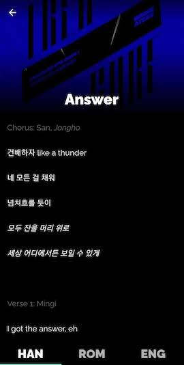

# ATEEZ Lyrics 

Read ATEEZ lyrics in Hangul, Romanized, or English.

### Screenshots

### Development Environment

- Flutter 3.7.12

- Android Studio version 2022.2

- JDK 17

- Gradle version 7.6.1

- Android Studio Gradle plugin version 7.4.0

### Acknowledgments

- App created using [Flutter](https://flutter.dev/).

- Lyrics obtained from [Genius](https://genius.com/artists/Ateez), [YouTube search results](https://www.youtube.com/results?search_query=ateez+lyrics), and [Google Translate](https://translate.google.com/).

- Album cover art obtained from [YouTube Music](https://music.youtube.com/channel/UCmWwbZ-8SngcUzRAD8rCVvw).

- Home page images obtained from Google image search results: ["ateez halazia"](https://www.google.com/search?sxsrf=APwXEdegswrToRCbrhTy_GqqPEXI_x-VnQ:1683206477681&q=ateez+halazia&tbm=isch&sa=X&ved=2ahUKEwja6b3h4Nv-AhXaFFkFHVJMAAIQ0pQJegQIExAB&biw=1440&bih=764&dpr=2), ["ateez deja vu"](https://www.google.com/search?q=ateez+deja+vu&tbm=isch&ved=2ahUKEwjG98iL4dv-AhXSGVkFHVHXCe8Q2-cCegQIABAA&oq=ateez+deja+vu&gs_lcp=CgNpbWcQAzIHCAAQGBCABDIHCAAQGBCABDIHCAAQGBCABDIHCAAQGBCABDIHCAAQGBCABDIHCAAQGBCABDIHCAAQGBCABDIHCAAQGBCABDIHCAAQGBCABDIHCAAQGBCABDoECCMQJzoFCAAQgARQzgRY8gpgyQxoAHAAeACAAbEBiAGpBZIBAzcuMZgBAKABAaoBC2d3cy13aXotaW1nwAEB&sclient=img&ei=pbFTZIaROdKz5NoP0a6n-A4&bih=764&biw=1440).

- Launcher icon created using [Inkscape](https://inkscape.org/).

- Images optimized using [ImageOptim](https://imageoptim.com/mac).
